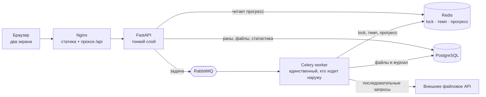
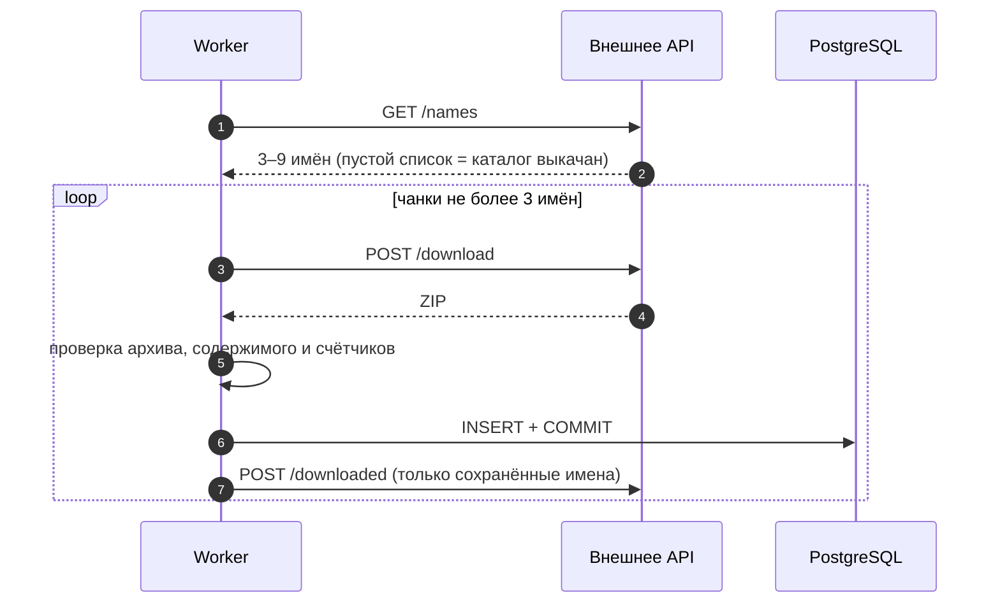

# DigitFlow

Сервис выкачивает каталог текстовых файлов через внешнее API, которое намеренно
мешает это сделать — отдаёт имена мелкими порциями, ограничивает частоту
запросов и банит на полчаса, — сохраняет проверенные данные в PostgreSQL
и считает встречаемость цифр `0–9`.

Два экрана: ход выкачки и список файлов с расчётами.

## Интерфейс

| Выкачка каталога | Успешное завершение |
|:---:|:---:|
|  |  |

| Список скачанных файлов | Статистика по выбранным файлам |
|:---:|:---:|
|  |  |

## Возможности

**Выкачка.** Кнопка создаёт один фоновый ран. Страница показывает время старта
по Новосибирску, прогресс, паузу с обратным отсчётом и журнал событий. Повторный
запуск заблокирован, пока ран активен; состояние живёт на сервере и переживает
перезагрузку вкладки.

**Файлы и расчёты.** Сортировка по времени скачивания, пагинация, выбор
в трёх режимах — точечно, вся страница, вообще все файлы базы. Результат:
суммарная таблица по каждой цифре и постраничная разбивка по файлам.

**Устойчивость к внешнему API.** Строго последовательные запросы с общим темпом
в Redis, обработка `429`, `403`, `Retry-After`, сетевых ошибок и `5xx`, чанки
не более трёх имён, строгая проверка ZIP и ответов, защита от бесконечного
цикла и от повторно доставленных задач.

**Демонстрационный режим.** Локальная заглушка внешнего API, чтобы показывать
процесс сколько угодно раз, не расходуя одноразовый идентификатор.

## Архитектура



**FastAPI** во внешнее API не ходит: он кладёт задачу в очередь, читает прогресс
из Redis и отдаёт данные из PostgreSQL. **Worker** — единственный, кто общается
с внешним сервисом и пишет скачанные файлы. **Redis** держит распределённый lock
«один активный ран», общий rate limit и оперативный прогресс. **PostgreSQL** —
источник правды по ранам, файлам и журналу.

### Как идёт выкачка



Порядок здесь несущий. Файл подтверждается только после успешного коммита:
`/names` выдаёт всё, что не подтверждено, а `/downloaded` отвергает имена,
которых нет в каталоге. Файл, который не удалось ни сохранить, ни подтвердить,
возвращался бы бесконечно — поэтому такая ошибка завершает ран с диагностикой,
а не замалчивается. Здоровые имена того же чанка при этом всё равно
скачиваются и сохраняются.

### Гарантии

1. `/downloaded` вызывается только после успешного коммита проверенных файлов.
2. Внешние запросы никогда не выполняются параллельно.
3. Имена всегда разбиваются на чанки не более трёх.
4. `Retry-After` приоритетнее собственного backoff.
5. Пустой ответ `/names` — единственный признак полного завершения.
6. Частичный уникальный индекс PostgreSQL допускает только один активный ран.
7. Redis-lock продлевается heartbeat-ом и снимается только владельцем.
8. Условные переходы состояний не дают повторной доставке оживить закрытый ран.


## Быстрый запуск

Понадобятся Git, Docker Desktop и Docker Compose. Локальный Python не нужен.

1. Создайте локальную конфигурацию:

   ```powershell
   Copy-Item .env.example .env
   ```

   Для Linux и macOS — `cp .env.example .env`.

2. Откройте `.env` и замените `CANDIDATE_ID=change-me` на уникальный идентификатор.

3. Соберите и запустите:

   ```powershell
   docker compose up --build -d
   docker compose ps
   ```

   При старте API сам выполняет `alembic upgrade head`; повторный запуск
   безопасен — применяются только новые миграции.

4. Откройте [http://localhost:8080](http://localhost:8080).

Swagger UI — [http://localhost:8000/docs](http://localhost:8000/docs),
состояние зависимостей — [http://localhost:8000/api/health](http://localhost:8000/api/health).
Остановить без потери данных — `docker compose down`, удалить и данные —
`docker compose down -v`.

> `CANDIDATE_ID` одноразовый: после полной выкачки внешний `/names` навсегда
> возвращает для него пустой список. Не тратьте его на проверку интерфейса —
> для этого есть демонстрационный режим.

### Если что-то идёт не так

- **`502` сразу после `docker compose up`** — API ещё поднимается, nginx ждёт
  его healthcheck. Обновите страницу через несколько секунд.
- **Ран завершился сразу и скачал ноль файлов** — это не ошибка: каталог для
  этого `CANDIDATE_ID` уже выкачан, и внешний `/names` возвращает пустой список.
  Нужен новый идентификатор или демонстрационный режим.
- **Кнопка запуска заблокирована** — активен предыдущий ран. Если воркер упал,
  осиротевший ран закрывается сам при очередном опросе состояния, и кнопка
  разблокируется.
- Логи: `docker compose logs -f worker` для процесса выкачки,
  `docker compose logs api` для запросов.

## Демонстрационный режим

Заглушка повторяет контракт внешнего API и не делает к нему ни одного запроса.

1. Поставьте `DEMO_MODE=true` в `.env` и примените конфигурацию:

   ```powershell
   docker compose up -d
   ```

2. Запустите заглушку внутри контейнера API:

   ```powershell
   docker compose exec -d api python tools/fake_external_api.py --catalog 10
   ```

3. На странице скачивания включите «Тестовый прогон» и нажмите «Скачать данные».

`--catalog` задаёт размер каталога, `--missing 7` делает одно имя недоступным
и показывает обработку `404`. Состояние заглушки — `GET http://api:9000/_state`
изнутри Docker-сети. Остановить: `docker compose restart api`.

Такой ран помечен в интерфейсе и в журнале, но его файлы лежат в общей таблице.
Убрать их вместе с ранами и журналом:

```powershell
docker compose exec -T postgres psql -U app -d files -c "DELETE FROM file WHERE run_id IN (SELECT id FROM download_run WHERE demo); DELETE FROM download_run WHERE demo;"
```

## Внутреннее API

| Метод | Путь | Назначение |
|---|---|---|
| `GET` | `/api/config` | какие возможности разрешены интерфейсу |
| `POST` | `/api/runs` | создать ран выкачки |
| `GET` | `/api/runs/current` | текущее или последнее состояние рана |
| `GET` | `/api/files` | список файлов с сортировкой и пагинацией |
| `POST` | `/api/stats` | статистика по выбранным файлам |
| `GET` | `/api/health` | доступность PostgreSQL и Redis |

Выбор «Вообще все» уходит как `select_all: true`, без загрузки идентификаторов
в браузер. Сервер возвращает отсечку `as_of`, и страницы одного расчёта остаются
согласованными даже при идущей параллельно выкачке.

## Конфигурация

Всё читается из окружения, полный шаблон с комментариями — в
[`.env.example`](.env.example). Основное:

| Переменная | Назначение |
|---|---|
| `EXTERNAL_API_BASE_URL` | адрес внешнего API |
| `CANDIDATE_ID` | значение заголовка `X-Candidate-Id` |
| `DEMO_MODE` | разрешить демонстрационные раны |
| `DEMO_API_BASE_URL` | адрес локальной заглушки |
| `EXTERNAL_MIN_INTERVAL_MS` | исходный интервал между запросами |
| `EXTERNAL_MIN_INTERVAL_MAX_MS` | потолок интервала после `429` |
| `MAX_RETRY_WAIT_S` | максимальная разовая пауза |
| `NETWORK_MAX_ATTEMPTS` | попытки при сетевых ошибках и `5xx` |
| `RUN_LOCK_TTL_S` | TTL lock активного рана |
| `RUN_LOCK_HEARTBEAT_S` | период продления lock |
| `DISPLAY_TIMEZONE` | зона времени интерфейса |

Опасные значения и их сочетания отклоняются при старте приложения, а не всплывают
посреди выкачки.

## Тесты

Набор разделён на две части: `tests/unit` не требует внешних сервисов,
`tests/integration` работает против PostgreSQL и Redis.

```powershell
docker compose run --rm api pytest
docker compose run --rm api pytest tests/unit
docker compose run --rm api ruff check .
docker compose run --rm api ruff format --check .
```

Текущая проверенная версия — **272 теста**: 116 unit и 156 integration.

Тесты используют отдельные базу PostgreSQL и номер базы Redis и отказываются
запускаться, если адреса совпадают с рабочими. Публикация настоящей
Celery-задачи в тестах заблокирована, к боевому API не обращается ни один тест.

Состояние миграций:

```powershell
docker compose exec -T api alembic current
docker compose exec -T api alembic heads
```

Обе команды должны показывать одну ревизию.

## Ограничения

- прерванный ран не продолжается: сервис обнаруживает осиротевший ран, закрывает
  его, и пользователь запускает новый;
- прогресс не показывает процент — общий размер каталога заранее неизвестен;
- фронтенд не покрыт автотестами, проверялся вручную; тесты покрывают бэкенд;
- размер страницы в разбивке по файлам фиксирован и не меняется из интерфейса;
- файлы демонстрационного рана в общем списке не помечены — помечен сам ран.

## Стек

Python 3.12, FastAPI, SQLAlchemy 2, PostgreSQL, Redis, RabbitMQ, Celery, Nginx,
vanilla JavaScript, Docker Compose.

## Структура проекта

```text
app/
  api/           роутеры: раны, файлы, статистика
  services/      состояния рана и агрегация статистики
  worker/        Celery-задача, цикл выкачки, клиент внешнего API
migrations/      миграции Alembic
nginx/           reverse proxy и раздача SPA
static/          интерфейс без сборки и Node.js
tests/
  unit/          без внешних сервисов
  integration/   против PostgreSQL и Redis
tools/           локальная заглушка внешнего API
```

