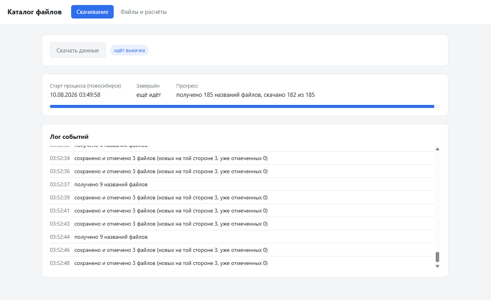
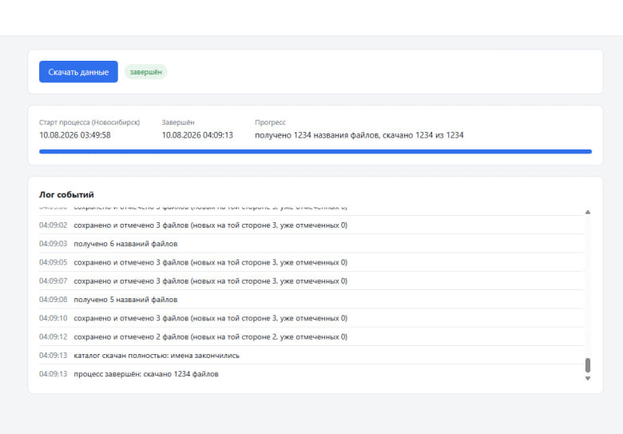
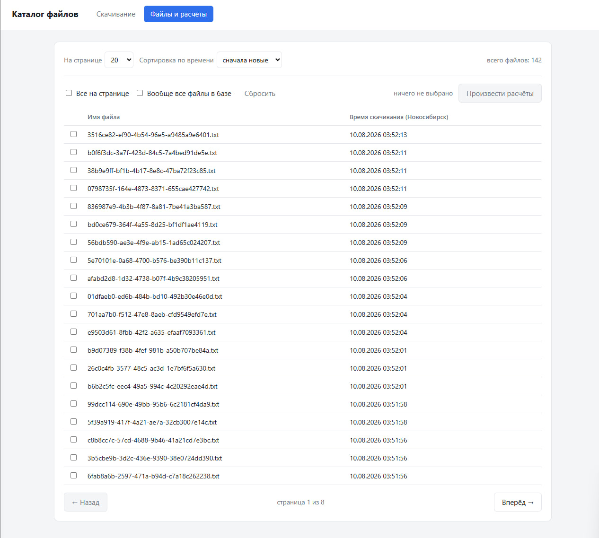
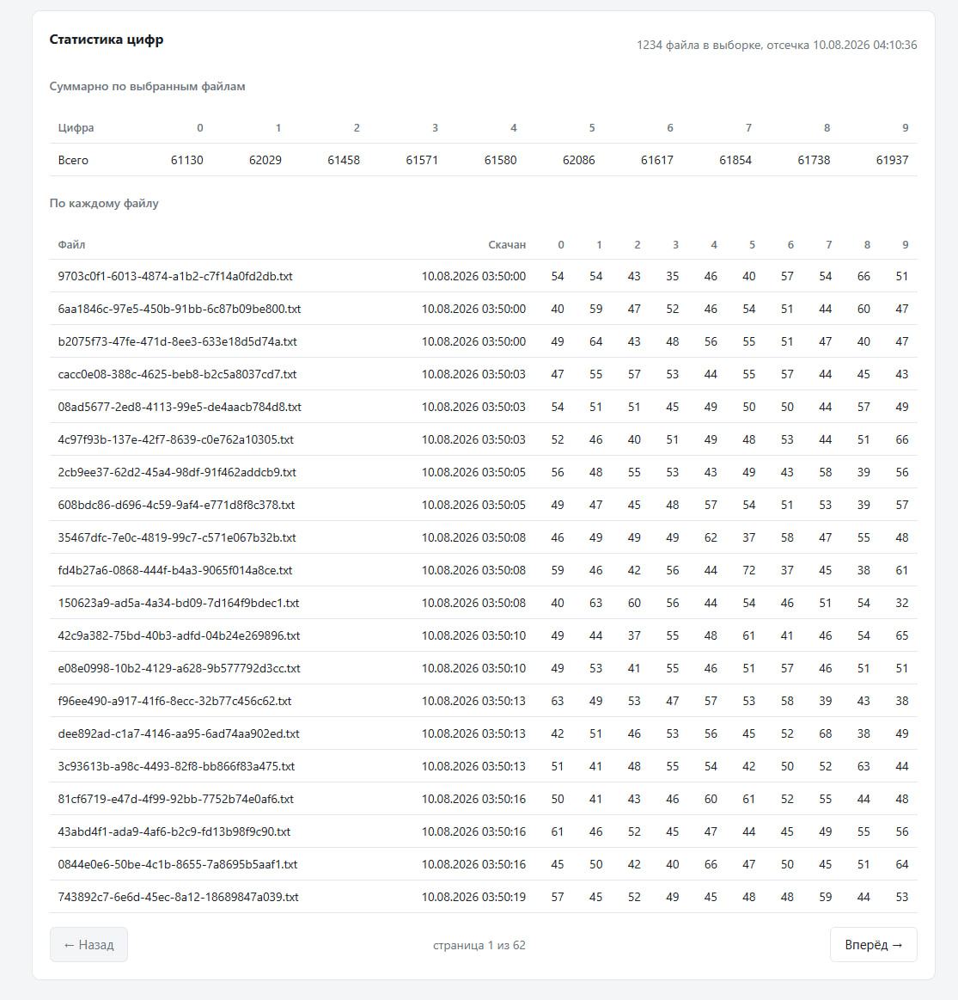

# DigitFlow

Сервис скачивает каталог текстовых файлов через ограниченное внешнее API,
сохраняет проверенные данные в PostgreSQL и считает встречаемость цифр `0–9`.
Веб-интерфейс состоит из двух экранов: ход выкачки и список файлов с расчётами.

## Что реализовано

- фоновая выкачка через Celery и RabbitMQ;
- строго последовательные запросы к внешнему API с общим rate limit в Redis;
- обработка `429`, `403`, `Retry-After`, сетевых ошибок и `5xx`;
- скачивание порциями не более трёх файлов и строгая проверка ZIP;
- сохранение в PostgreSQL до подтверждения через `/downloaded`;
- защита от параллельных и повторно доставленных ранов;
- пагинация, сортировка и три режима выбора файлов;
- общая и постраничная статистика цифр;
- безопасный демонстрационный режим с локальной заглушкой API;
- unit- и integration-тесты без обращений к боевому API.

## Интерфейс

| Выкачка каталога | Успешное завершение |
|:---:|:---:|
|  |  |

| Список скачанных файлов | Статистика по выбранным файлам |
|:---:|:---:|
|  |  |

## Стек

Python 3.12, FastAPI, SQLAlchemy 2, PostgreSQL, Redis, RabbitMQ, Celery,
Nginx, vanilla JavaScript и Docker Compose.

## Быстрый запуск

Понадобятся Git, Docker Desktop и Docker Compose. Локальный Python не нужен.

1. Создайте локальную конфигурацию:

   ```powershell
   Copy-Item .env.example .env
   ```

   Для Linux/macOS эквивалентная команда — `cp .env.example .env`.

2. Откройте `.env` и замените `CANDIDATE_ID=change-me` на уникальный идентификатор.

3. Соберите и запустите сервис:

   ```powershell
   docker compose up --build -d
   docker compose ps
   ```

   При старте API автоматически выполняет `alembic upgrade head`. Повторный
   запуск безопасен: Alembic применяет только ещё не выполненные миграции.

4. Откройте [http://localhost:8080](http://localhost:8080).

FastAPI и Swagger UI напрямую доступны на
[http://localhost:8000/docs](http://localhost:8000/docs). Состояние зависимостей:
[http://localhost:8000/api/health](http://localhost:8000/api/health).

Остановить сервис без удаления данных:

```powershell
docker compose down
```

> `CANDIDATE_ID` одноразовый: после полной выкачки внешний `/names` всегда
> возвращает для него пустой список. Не запускайте обычный ран для пробной
> проверки интерфейса — используйте демонстрационный режим ниже.

## Демонстрационный режим

Заглушка повторяет контракт внешнего API и не делает сетевых запросов к боевому
сервису.

1. Установите `DEMO_MODE=true` в `.env` и примените конфигурацию:

   ```powershell
   docker compose up --build -d
   ```

2. Запустите заглушку внутри контейнера API:

   ```powershell
   docker compose exec -d api python tools/fake_external_api.py --catalog 10
   ```

3. На странице скачивания включите «Тестовый прогон» и нажмите
   «Скачать данные».

Параметр `--catalog` задаёт размер каталога. Дополнительный аргумент `--missing 7`
делает одно имя недоступным и демонстрирует обработку `404`; без него ран
завершится успешно.
Состояние заглушки доступно внутри Docker-сети по `GET http://api:9000/_state`.

Остановить заглушку можно перезапуском API:

```powershell
docker compose restart api
```

Файлы демонстрационного рана сохраняются в общей таблице. Следующая команда
необратимо удаляет демонстрационные файлы, их журнал и сами раны, не затрагивая
обычные данные:

```powershell
docker compose exec -T postgres psql -U app -d files -c "DELETE FROM file WHERE run_id IN (SELECT id FROM download_run WHERE demo); DELETE FROM download_run WHERE demo;"
```

## Использование

### Скачивание

Кнопка «Скачать данные» создаёт один фоновый ран. Страница показывает время
старта по Новосибирску, прогресс, текущую паузу с обратным отсчётом и журнал
событий. Повторный запуск заблокирован, пока ран активен.

Процесс завершается только после пустого ответа `/names`. Ошибка конкретного
файла не замалчивается: здоровые файлы чанка сохраняются, а ран завершается с
диагностикой, чтобы неподтверждённое имя не создало бесконечный цикл.

### Файлы и расчёты

На втором экране доступны:

- сортировка по времени скачивания;
- изменение размера страницы и пагинация;
- точечный выбор, выбор страницы или всех файлов базы;
- суммарная статистика цифр и постраничная разбивка по файлам.

Выбор «Вообще все» передаётся как `select_all: true`, без загрузки всех
идентификаторов в браузер. Сервер возвращает отсечку `as_of`, поэтому страницы
одного расчёта остаются согласованными при продолжающейся выкачке.

## Проверки

Тесты используют отдельные PostgreSQL-базу и Redis DB и отказываются запускаться,
если их адреса совпадают с рабочими. Публикация настоящей Celery-задачи в тестах
также заблокирована.

```powershell
docker compose run --rm api pytest
docker compose run --rm api ruff check .
docker compose run --rm api ruff format --check .
```

Текущая проверенная версия содержит 272 проходящих теста.

Проверить состояние миграций вручную:

```powershell
docker compose exec -T api alembic current
docker compose exec -T api alembic heads
```

Обе команды должны показывать одну и ту же ревизию.

## Внутреннее API

| Метод | Путь | Назначение |
|---|---|---|
| `GET` | `/api/config` | настройки возможностей UI |
| `POST` | `/api/runs` | создать ран выкачки |
| `GET` | `/api/runs/current` | текущее или последнее состояние рана |
| `GET` | `/api/files` | список файлов с сортировкой и пагинацией |
| `POST` | `/api/stats` | статистика по выбранным файлам |
| `GET` | `/api/health` | доступность PostgreSQL и Redis |

## Конфигурация

Все настройки читаются из окружения. Полный шаблон с комментариями находится в
[`.env.example`](.env.example). Основные параметры:

| Переменная | Назначение |
|---|---|
| `EXTERNAL_API_BASE_URL` | адрес внешнего API |
| `CANDIDATE_ID` | значение заголовка `X-Candidate-Id` |
| `DEMO_MODE` | разрешить демонстрационные раны |
| `DEMO_API_BASE_URL` | адрес локальной заглушки |
| `EXTERNAL_MIN_INTERVAL_MS` | исходный интервал между запросами |
| `EXTERNAL_MIN_INTERVAL_MAX_MS` | потолок интервала после `429` |
| `MAX_RETRY_WAIT_S` | максимальная разовая пауза |
| `NETWORK_MAX_ATTEMPTS` | число попыток при сетевых ошибках и `5xx` |
| `RUN_LOCK_TTL_S` | TTL lock активного рана |
| `RUN_LOCK_HEARTBEAT_S` | период продления lock |
| `DISPLAY_TIMEZONE` | зона времени интерфейса |

Некорректные и опасные сочетания значений отклоняются при старте приложения.

## Архитектура и гарантии

Браузер обращается через Nginx к FastAPI. API фиксирует ран в PostgreSQL и
публикует Celery-задачу в RabbitMQ. Worker последовательно обращается к внешнему
API, хранит lock, темп запросов и оперативный прогресс в Redis, а файлы и журнал
— в PostgreSQL.

Ключевые гарантии:

1. `/downloaded` вызывается только после успешного коммита проверенных файлов.
2. Внешние запросы никогда не выполняются параллельно.
3. Имена всегда разбиваются на чанки не более трёх.
4. `Retry-After` имеет приоритет над собственным backoff.
5. Пустой `/names` — единственный признак полного завершения.
6. Частичный уникальный индекс PostgreSQL допускает только один активный ран.
7. Redis-lock продлевается heartbeat-ом и снимается только владельцем.
8. Условные переходы state machine не позволяют повторной доставке оживить
   завершённый ран.

## Структура проекта

```text
app/             FastAPI, сервисы, модели и worker
migrations/      миграции Alembic
nginx/           reverse proxy и раздача SPA
static/          интерфейс без сборки и Node.js
tests/           unit- и integration-тесты
tools/           локальная заглушка внешнего API
```
